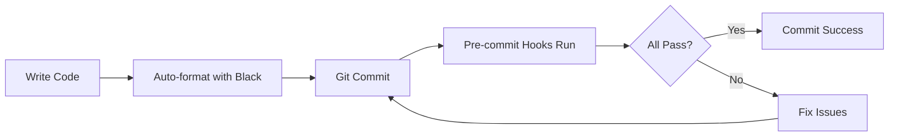

# 🚀 Quick Reference - Code Analysis Tools

## ⚡ Quick Commands

```bash
# Full analysis (recommended)
python run_analysis.py

# Duplicate detection only
npm run check:duplicates

# Watch mode (during development)
npm run check:duplicates:watch

# Pylint with custom rules
pylint --rcfile=.pylintrc .

# Security scan
bandit -r . -c .bandit.yaml

# Pre-commit checks
pre-commit run --all-files
```

## 📊 What Each Tool Does

| Tool | Purpose | Reports Location |
|------|---------|------------------|
| **jscpd** | Finds duplicate code | `reports/jscpd/html/index.html` |
| **Pylint** | Detects code patterns & issues | `reports/pylint_report.json` |
| **Bandit** | Security vulnerabilities | `reports/bandit_report.json` |
| **Pre-commit** | Auto-checks before commits | Console output |

## 🎯 Current Project Stats

**Latest Analysis:**
- **22 duplicates found** (3.96% duplication)
- **Files analyzed:** 22 Python files
- **Total lines:** 6,605
- **Main duplicates in:**
  - Test files (setup patterns)
  - Agent classes (similar initialization)
  - API client (error handling)

## 🔧 Custom Pylint Rules

| Rule ID | What it detects | Severity |
|---------|----------------|----------|
| W9001 | Duplicate try-except patterns | Warning |
| W9002 | Duplicate API calls | Warning |
| W9003 | Hardcoded URLs/constants | Warning |
| W9004 | Missing async error handling | Warning |
| W9005 | Excessive nesting (>3 levels) | Warning |
| W9006 | Too many local variables (>15) | Warning |
| W9101 | Agent missing required methods | Warning |
| W9103 | Agent missing logging | Warning |

## 💡 Common Fixes

### Fix Duplicate Code
```python
# ❌ Before
def fetch_user():
    try:
        response = client.get("/users")
    except HTTPError:
        log.error("Failed")

def fetch_posts():
    try:
        response = client.get("/posts")
    except HTTPError:
        log.error("Failed")

# ✅ After
@handle_http_errors
def fetch_user():
    return client.get("/users")

@handle_http_errors
def fetch_posts():
    return client.get("/posts")
```

### Fix Hardcoded Strings
```python
# ❌ Before
api_url = "https://api.example.com/v1/endpoint"

# ✅ After
API_BASE_URL = "https://api.example.com/v1"
api_url = f"{API_BASE_URL}/endpoint"
```

### Fix Excessive Nesting
```python
# ❌ Before
if condition1:
    if condition2:
        if condition3:
            if condition4:  # Too deep!
                do_something()

# ✅ After
if not condition1:
    return
if not condition2:
    return
if not condition3:
    return
if condition4:
    do_something()
```

## 🔄 Development Workflow



1. **Write code** normally
2. **Commit** - pre-commit hooks auto-run
3. **Fix issues** if hooks fail
4. **Push** with confidence

## 📈 Integration Points

### VSCode
Add to `.vscode/settings.json`:
```json
{
  "python.linting.pylintEnabled": true,
  "python.linting.pylintArgs": ["--rcfile=.pylintrc"],
  "python.formatting.provider": "black",
  "editor.formatOnSave": true
}
```

### GitHub Actions
```yaml
- name: Code Analysis
  run: python run_analysis.py
```

### Pre-push Hook (optional)
```bash
#!/bin/bash
npm run check:duplicates:ci && python run_analysis.py
```

## 🎨 Report Formats

### jscpd HTML Report
- Visual interface
- Shows exact duplicate locations
- Compare side-by-side
- **Open:** `reports/jscpd/html/index.html`

### Pylint JSON Report
- Machine-readable
- CI/CD integration
- Custom processing
- **Location:** `reports/pylint_report.json`

### Analysis Summary
- Combined overview
- All tools in one
- **Run:** `python run_analysis.py`

## 🚨 Troubleshooting

### Issue: "jscpd not found"
**Fix:** `npm install`

### Issue: "Pylint custom checkers not loading"
**Fix:** Ensure you're in project root: `cd /path/to/OMA_REFACTORED`

### Issue: "Pre-commit hooks not running"
**Fix:** `pre-commit install`

### Issue: "Analysis too slow"
**Fix:** Analyze specific files: `pylint core/ai_client.py`

## 📚 Learn More

- **Full Guide:** `CODE_ANALYSIS_GUIDE.md`
- **Setup Script:** `setup_analysis.bat` (Windows) or `setup_analysis.sh` (Linux/Mac)
- **Configuration:** `.pylintrc`, `.jscpd.json`, `.pre-commit-config.yaml`

## 🎯 Quality Goals

| Metric | Current | Target |
|--------|---------|--------|
| Duplication % | 3.96% | < 5% ✅ |
| Critical Issues | - | 0 |
| Security Issues | - | 0 |
| Code Coverage | - | > 80% |

---

**Need Help?** Run `python run_analysis.py` for detailed analysis or check `CODE_ANALYSIS_GUIDE.md`
