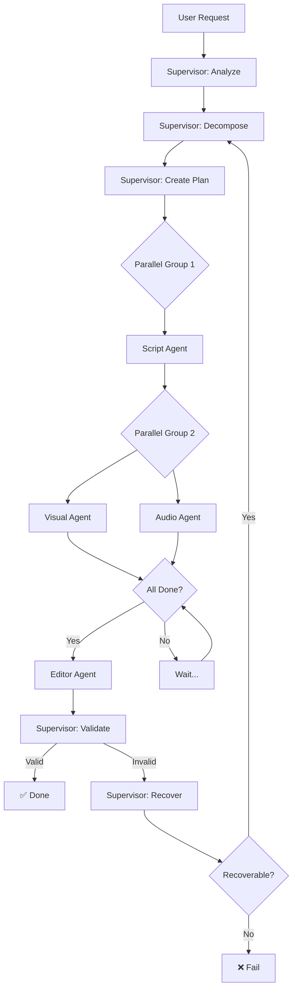

# 🧠 Supervisor Patterns - Arquitetura Multi-Agente

## Índice
1. [Visão Geral](#visão-geral)
2. [Padrões de Referência](#padrões-de-referência)
3. [Implementação OMA](#implementação-oma)
4. [Comparativo de Abordagens](#comparativo-de-abordagens)
5. [Fluxogramas](#fluxogramas)

---

## Visão Geral

O **Supervisor Pattern** é um padrão de arquitetura multi-agente onde um agente central coordena múltiplos agentes especializados (workers) para completar tarefas complexas.

### Vantagens
✅ Modularidade e especialização
✅ Paralelização de tarefas independentes
✅ Recuperação de erros localizada
✅ Escalabilidade horizontal
✅ Manutenibilidade

### Desvantagens
⚠️ Overhead de coordenação
⚠️ Single point of failure (supervisor)
⚠️ Complexidade na gestão de estado

---

## Padrões de Referência

### 1. AWS Bedrock Multi-Agent Collaboration

**Modelo:** Supervisor with Routing Mode

```
┌──────────────────────────────────────────────────────────┐
│          SUPERVISOR AGENT (Bedrock Claude)              │
│  ────────────────────────────────────────────────────── │
│  • Analisa input do usuário                             │
│  • Break down complex problems                          │
│  • Routes requests to collaborator agents               │
│  • Consolidates outputs into final response             │
└──────────────────────────────────────────────────────────┘
                         │
        ┌────────────────┼────────────────┐
        ↓                ↓                ↓
┌─────────────┐  ┌─────────────┐  ┌─────────────┐
│ Collaborator│  │ Collaborator│  │ Collaborator│
│  Agent 1    │  │  Agent 2    │  │  Agent 3    │
│             │  │             │  │             │
│ (Tools +    │  │ (Tools +    │  │ (Tools +    │
│  Knowledge) │  │  Knowledge) │  │  Knowledge) │
└─────────────┘  └─────────────┘  └─────────────┘
```

**Características:**
- **Inline Agents:** Criados dinamicamente em runtime
- **Parallel Communication:** Workers podem executar simultaneamente
- **Automatic Routing:** Supervisor decide qual agent chamar
- **Fallback Mode:** Se não detectar intenção clara, supervisor orquestra manualmente

**Exemplo de Código (Bedrock SDK):**
```python
import boto3

bedrock = boto3.client('bedrock-agent')

# Criar supervisor agent
supervisor = bedrock.create_agent(
    agentName='SupervisorAgent',
    foundationModel='anthropic.claude-3-sonnet',
    instruction='You are a supervisor coordinating video creation agents'
)

# Associar collaborators
bedrock.associate_agent_collaborator(
    agentId=supervisor['agentId'],
    collaboratorAgents=[
        {'agentId': script_agent_id, 'role': 'SCRIPT_WRITER'},
        {'agentId': visual_agent_id, 'role': 'VISUAL_PLANNER'},
        {'agentId': audio_agent_id, 'role': 'AUDIO_PRODUCER'}
    ]
)

# Invocar supervisor
response = bedrock.invoke_agent(
    agentId=supervisor['agentId'],
    inputText='Create a 30s commercial video for a coffee shop'
)
```

---

### 2. Azure AI Multi-Agent Orchestrator

**Modelo:** Supervisor-Worker with Agent Bricks

```
┌──────────────────────────────────────────────────────────┐
│     MULTI-AGENT SUPERVISOR (Semantic Kernel)            │
│  ────────────────────────────────────────────────────── │
│  • Sequential Orchestration (tasks in order)            │
│  • Concurrent Orchestration (parallel execution)        │
│  • Supervisor-Worker Model (task branching)             │
└──────────────────────────────────────────────────────────┘
                         │
        ┌────────────────┼────────────────┐
        ↓                ↓                ↓
┌─────────────┐  ┌─────────────┐  ┌─────────────┐
│ Genie Space │  │ Unity       │  │ MCP         │
│  Agent      │  │ Catalog Fn  │  │ Server      │
│             │  │             │  │             │
│ (Databricks)│  │ (Functions) │  │ (Tools)     │
└─────────────┘  └─────────────┘  └─────────────┘
```

**Características:**
- **Agent Bricks:** Componentes reutilizáveis
- **State Management:** Typed state com checkpoints (LangGraph)
- **Orchestration Patterns:** Sequential, Concurrent, Supervisor-Worker
- **Connected Agents:** Simplificam handoffs entre agentes

**Exemplo de Código (Semantic Kernel):**
```python
from semantic_kernel import Kernel
from semantic_kernel.agents import AgentGroupChat, ChatCompletionAgent

kernel = Kernel()

# Definir supervisor
supervisor = ChatCompletionAgent(
    kernel=kernel,
    name="Supervisor",
    instructions="Coordinate video creation agents",
    model="gpt-4"
)

# Definir workers
script_agent = ChatCompletionAgent(
    kernel=kernel,
    name="ScriptWriter",
    instructions="Write engaging video scripts"
)

visual_agent = ChatCompletionAgent(
    kernel=kernel,
    name="VisualPlanner",
    instructions="Plan visual storyboards"
)

# Criar group chat
chat = AgentGroupChat(
    agents=[supervisor, script_agent, visual_agent],
    termination_strategy=TerminationStrategy.supervisor_approval()
)

# Executar
async for message in chat.invoke("Create a coffee shop video"):
    print(f"{message.author}: {message.content}")
```

---

### 3. Google Vertex AI Agent Builder (ADK)

**Modelo:** LangGraph Supervisor State Graph

```
┌──────────────────────────────────────────────────────────┐
│        SUPERVISOR (Agent Development Kit - ADK)          │
│  ────────────────────────────────────────────────────── │
│  • Central orchestrator for multi-agent workflows       │
│  • State graph governs agent communication flow         │
│  • Pre-built patterns from Agent Garden                 │
└──────────────────────────────────────────────────────────┘
                         │
        ┌────────────────┼────────────────┐
        ↓                ↓                ↓
┌─────────────┐  ┌─────────────┐  ┌─────────────┐
│ Worker      │  │ Worker      │  │ Worker      │
│ Agent 1     │  │ Agent 2     │  │ Agent 3     │
│             │  │             │  │             │
│ (Performs   │  │ (Performs   │  │ (Responds   │
│  tasks)     │  │  tasks)     │  │  with       │
│             │  │             │  │  FINISH)    │
└─────────────┘  └─────────────┘  └─────────────┘
```

**Características:**
- **State Graph:** LangGraph para fluxo de controle
- **Quality Artifacts:** Workers produzem outputs de alta qualidade
- **Agent Garden:** Biblioteca de patterns pré-construídos
- **7M+ Downloads:** Amplamente adotado

**Exemplo de Código (Vertex AI ADK + LangGraph):**
```python
from langgraph.graph import StateGraph, END
from vertexai.preview.agents import Agent

class SupervisorState(TypedDict):
    messages: list
    next_agent: str
    final_output: Optional[dict]

# Criar state graph
workflow = StateGraph(SupervisorState)

# Nó supervisor
def supervisor_node(state):
    # Decidir qual agente chamar
    last_message = state["messages"][-1]

    if "script" in last_message:
        return {"next_agent": "visual_agent"}
    elif "visual" in last_message:
        return {"next_agent": "audio_agent"}
    else:
        return {"next_agent": END}

# Adicionar nós
workflow.add_node("supervisor", supervisor_node)
workflow.add_node("script_agent", script_agent_node)
workflow.add_node("visual_agent", visual_agent_node)
workflow.add_node("audio_agent", audio_agent_node)

# Definir edges condicionais
workflow.add_conditional_edges(
    "supervisor",
    lambda x: x["next_agent"]
)

# Compilar
app = workflow.compile()

# Executar
result = app.invoke({
    "messages": [{"role": "user", "content": "Create video"}]
})
```

---

## Implementação OMA

### Arquitetura Escolhida

O sistema OMA v3.0 implementa um **híbrido** dos três padrões:

```
┌──────────────────────────────────────────────────────────┐
│      SUPERVISOR AGENT (Qwen2.5-3B-Instruct)             │
│  ────────────────────────────────────────────────────── │
│  AWS Bedrock:    Task decomposition & routing           │
│  Azure AI:       Parallel execution strategies          │
│  Vertex AI:      LangGraph state management             │
└──────────────────────────────────────────────────────────┘
                         │
        ┌────────────────┼────────────────┐
        ↓                ↓                ↓
┌──────────────┐  ┌──────────────┐  ┌──────────────┐
│ Script Agent │  │ Visual Agent │  │ Audio Agent  │
│ Phi-3.5 3.8B │  │ Gemma-2 2B   │  │ Mistral 7B   │
└──────────────┘  └──────────────┘  └──────────────┘
        │                │                │
        └────────────────┼────────────────┘
                         ↓
                ┌──────────────┐
                │ Editor Agent │
                │ Qwen2 1.5B   │
                └──────────────┘
```

### Principais Features

**1. Task Decomposition (AWS Bedrock)**
```python
async def decompose_task(self, analysis: Dict) -> List[SubTask]:
    """Quebra tarefa complexa em subtarefas atômicas"""
    # Usa Qwen2.5-3B para análise inteligente
    # Cria graph de dependências
    # Identifica paralelismo possível
```

**2. Parallel Execution (Azure AI)**
```python
def create_execution_plan(self, subtasks: List[SubTask]) -> ExecutionPlan:
    """Identifica tarefas que podem rodar em paralelo"""
    # Script: PRIMEIRO (bloqueante)
    # Visual + Audio: PARALELO (após script)
    # Editor: ÚLTIMO (após todos)
```

**3. State Management (Vertex AI / LangGraph)**
```python
class VideoState(TypedDict):
    task_id: str
    brief: dict
    script: Optional[dict]
    visual_plan: Optional[dict]
    audio_files: Optional[list]
    video_path: Optional[str]
    metadata: dict
    errors: list
```

---

## Comparativo de Abordagens

| Feature | AWS Bedrock | Azure AI | Vertex AI | **OMA v3.0** |
|---------|-------------|----------|-----------|--------------|
| **Orquestração** | Auto-routing | Semantic Kernel | LangGraph | **LangGraph + Custom** |
| **Paralelismo** | ✅ Automático | ✅ Configurável | ⚠️ Manual | **✅ Automático** |
| **Estado** | Interno | Checkpoints | State Graph | **State Graph + SQLite** |
| **Recovery** | ⚠️ Limitado | ✅ Retry logic | ✅ Human-in-loop | **✅ Multi-estratégia** |
| **Custo** | $$$ (Cloud) | $$$ (Cloud) | $$$ (Cloud) | **$ (Local SLMs)** |
| **Latência** | ~2 min | ~2 min | ~2 min | **~5 min** |
| **Privacidade** | ❌ Cloud | ❌ Cloud | ❌ Cloud | **✅ 100% Local** |
| **Offline** | ❌ | ❌ | ❌ | **✅** |
| **Customização** | ⚠️ Limitada | ✅ Alta | ✅ Alta | **✅ Total** |

---

## Fluxogramas

### Fluxo de Execução Completo



### Padrão de Comunicação Supervisor-Worker

```
┌────────┐                                    ┌────────┐
│        │  1. Delegate Task                  │        │
│ SUPER- │───────────────────────────────────>│ WORKER │
│ VISOR  │                                    │        │
│        │  2. Acknowledge                    │        │
│        │<───────────────────────────────────│        │
│        │                                    │        │
│        │  3. Progress Updates (optional)    │        │
│        │<·······························────│        │
│        │                                    │        │
│        │  4. Result                         │        │
│        │<───────────────────────────────────│        │
│        │                                    │        │
│        │  5. Validate & Synthesize          │        │
│        │                                    │        │
└────────┘                                    └────────┘
```

### Gestão de Estado (LangGraph)

```
     ┌──────────────┐
     │ EMPTY STATE  │
     └──────┬───────┘
            │
            ↓
     ┌──────────────┐
     │ + brief      │ ← Script Agent writes
     │ + analysis   │
     └──────┬───────┘
            │
            ↓
     ┌──────────────┐
     │ + script     │ ← Visual Agent writes
     │ + scenes     │
     └──────┬───────┘
            │
            ↓
     ┌──────────────┐
     │ + visuals    │ ← Audio Agent writes
     │ + audio      │
     └──────┬───────┘
            │
            ↓
     ┌──────────────┐
     │ + video_path │ ← Editor Agent writes
     │ + metadata   │
     └──────────────┘
```

---

## Lições Aprendidas dos Patterns

### Do AWS Bedrock
✅ **Routing automático** é poderoso mas precisa de LLM forte
✅ **Inline agents** permitem flexibilidade
⚠️ **Overhead de rede** é significativo em cloud

### Do Azure AI
✅ **Typed state** previne erros
✅ **Checkpoints** permitem recovery
✅ **Semantic Kernel** simplifica muito

### Do Vertex AI
✅ **LangGraph** é excelente para controle de fluxo
✅ **Agent Garden** acelera desenvolvimento
✅ **Pre-built patterns** são valiosos

### Aplicado no OMA v3.0
✅ Usamos **LangGraph** para state management
✅ Implementamos **parallel execution** explícita
✅ **SLMs locais** para privacidade e custo zero
✅ **Recovery strategies** multi-camada
✅ **Quality validation** antes de finalizar

---

## Próximos Passos

- [ ] Adicionar **Agent Registry** dinâmico
- [ ] Implementar **A/B testing** de strategies
- [ ] Criar **metrics dashboard** para supervisor
- [ ] Adicionar **human-in-the-loop** para decisões críticas
- [ ] Explorar **multi-supervisor** para projetos grandes

---

**Referências:**
- [AWS Bedrock Multi-Agent Docs](https://docs.aws.amazon.com/bedrock/latest/userguide/agents-multi-agent-collaboration.html)
- [Azure AI Orchestration Patterns](https://learn.microsoft.com/azure/architecture/ai-ml/guide/ai-agent-design-patterns)
- [Vertex AI Agent Builder](https://cloud.google.com/products/agent-builder)
- [LangGraph Documentation](https://langchain-ai.github.io/langgraph/)
